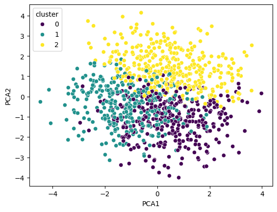
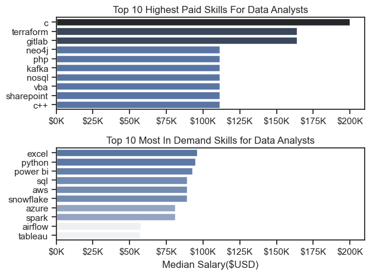

# ✨ Welcome to My Project Portfolio!
Hi there! 👋 I’m Niikitha . I am a Data Analyst who is passionate about uncovering stories hidden in data and turning numbers into actionable insights. This repository is a curated collection of my work—where curiosity meets analytics, and creativity drives solutions.

### 🤔 Why Explore My Projects?
Here, you’ll find:

- 📊 *Visualizations that simplify complexity.*
- 🤖 *Models that solve real-world problems.*
- 🚀 *Insights designed to inspire action and drive impact.*

Each project reflects my journey as a data and marketing analyst, blending technical expertise with a knack for storytelling.

### 🏆 Featured Projects
#### 👥 [Customer Segmentation for Marketing Analytics](https://github.com/nikitha108/Project_marketing)
- Objective: Grouping customers based on behavior to enhance personalized marketing strategies.
- Skills & Tools: Python (K-means clustering), Tableau | Highlights: Improved targeting and ROI.

   
*Visualization of the clusters.*

#### 🌍 [Data Analyst Job Trends in France](https://github.com/nikitha108/Project_Data)
- Objective: Analyze hiring trends for data analyst roles in France using job market data.
- Skills & Tools: Python (Web scraping, Pandas), Power BI | Insights: Key skills in demand, salary trends, and industry focus.

*Top paying and High demand skills for Data Analysts in France*
#### 🛒 [Sales Insights Dashboard](https://github.com/nikitha108/Sales_Consumer_Dashboard?tab=readme-ov-file)
- Objective: Analyzing consumer behavior to optimize sales strategies.
- Tools: Tableau | Outcome: Actionable business intelligence.

*Overview of the Sales Dashboard*

### 🛠 Skills at a Glance
- Data Analytics: **SQL**(MySQL, SQLite, Postgresql), **Python** (Pandas, NumPy, SciPy, Matplotlib)
- Visualization: **Tableau, Power BI, Excel**
- Marketing Analytics: **Google Analytics 4, A/B Testing, Tag Manager, ContentSquare , SimilarWeb, Salesforce CRM**
- Cloud Tools: **BigQuery, AWS Basics**
- Generative **AI & ChatGPT** Prompt Engineering
- **Git & Github**: Version Control & Sharing projects
- Soft Skills: Strong Analytical Thinking, Problem-Solving, Team Collaboration, Adaptability, Work Under Pressure, Presentation 

### 🌟 Let’s Connect!
I’m always eager to learn, collaborate, and create impactful solutions. Feel free to reach out or explore further:

🤝 [LinkedIn](https://www.linkedin.com/in/nikitha-sathish/)
🌐 Portfolio Website (Work in Progress!)

